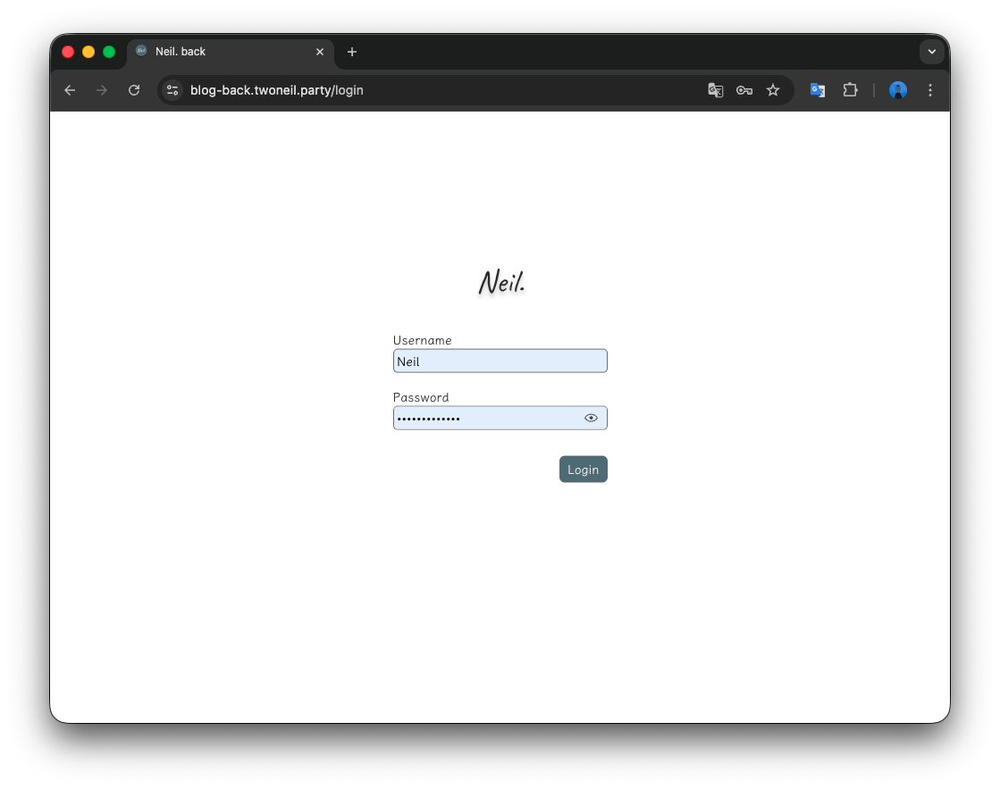
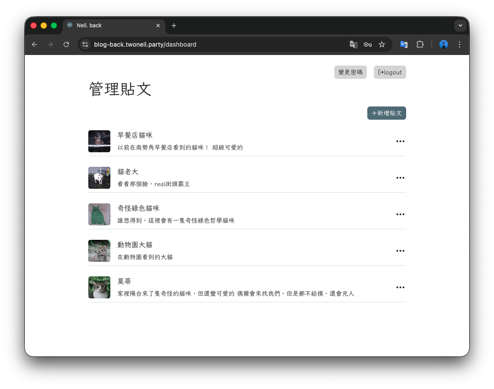
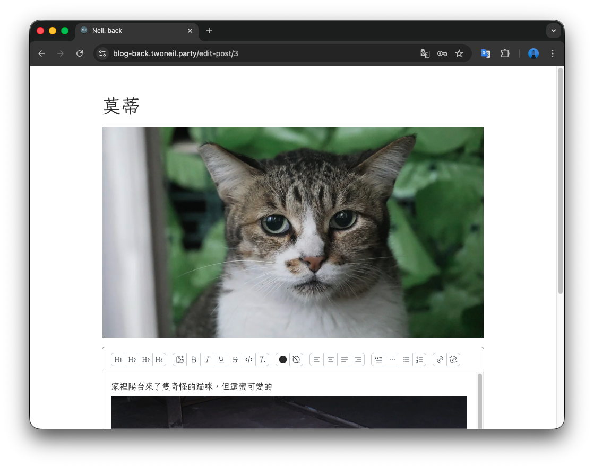

# 💻Blog Dashboard

這是一個專為部落格管理員設計的響應式後台管理系統，採用 React (Vite) 開發。系統整合了強大的富文本編輯器、即時圖片壓縮上傳預覽，以及完善的身份驗證流程。

## 🛠 技術棧

- Frontend: React + Vite
- Styling: Mantine
- State Management: React Context
- Form Handling: Mantine Form / zod
- Editor: Mantine Rich text editor

## ✨核心特色

- 路由保護：使用 React Context 保護管理頁面，未登入使用者將自動重導至登入頁。
- 自動登出機制：當 Token 過期，系統會自動導向登入頁。

## 📁 專案結構

```
public                  # 靜態資源（不經過 Vite 編譯）
src
├── assets              # 靜態資源 （會經過 Vite 編譯）
├── components          # UI 元件
├── context             # React Context 全局狀態管理
├── hooks               # 自定義 Hooks
├── pages               # 頁面級元件
├── utils               # 工具函式
├── routes.jsx          # 路由配置
├── theme.jsx           # Mantine 主題配置
├── theme.module.css    # 主題 CSS 模組
├── App.jsx             # 應用程式入口
├── App.css             # 全局樣式設定
└── main.jsx            # 渲染起點
vite.config.js          # Vite 設定檔
postcss.config.cjs      # Mantine CSS 處理設定
README.md
```

## 📸 界面展示 (Screenshots)

登入頁面



文章管理頁面



文章編輯畫面



## 🔑 環境變數設定（.env）

請在根目錄建立 .env 並參考以下設定：

```
# VITE_API_BASE_URL='/api'
```

## 🚀 快速啟動

1. 安裝依賴
```
npm install
```

2. 啟動專案
```
npm run dev
```
